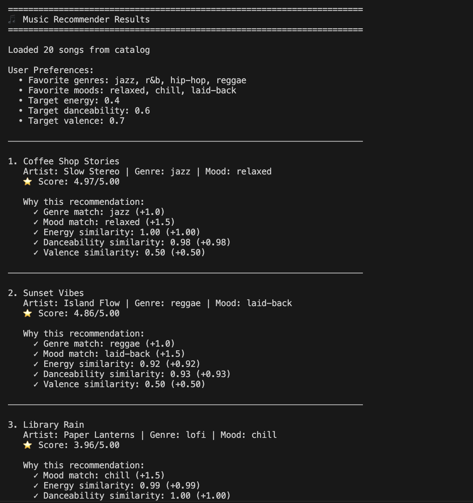

# 🎵 Music Recommender Simulation

## Project Summary

In this project you will build and explain a small music recommender system.

Your goal is to:

- Represent songs and a user "taste profile" as data
- Design a scoring rule that turns that data into recommendations
- Evaluate what your system gets right and wrong
- Reflect on how this mirrors real world AI recommenders

Replace this paragraph with your own summary of what your version does.

---

## How The System Works

### Real-World Recommendation Principle

Real music recommenders work by matching songs to a user's taste profile using content-based filtering. They answer two key questions:
1. **Scoring Rule**: For each song, "How similar is this to what the user likes?"
2. **Ranking Rule**: For the full catalog, "In what order should we show these recommendations?"

Our simulation simplifies this to focus on understanding how these rules combine multiple features into meaningful suggestions.

### Our Design

**Song Features:**
- `genre` (categorical): pop, lofi, rock, ambient, jazz, synthwave, indie pop
- `mood` (categorical): happy, chill, intense, relaxed, focused, moody
- `energy` (numerical, 0–1): intensity and liveliness of the track
- `danceability` (numerical, 0–1): how well-suited the song is for dancing
- `valence` (numerical, 0–1): musical positivity and happiness
- `tempo_bpm` (numerical): beats per minute (60–152)

**UserProfile Stores:**
- Preferred `genre` and `mood` (what the user likes)
- Ideal `energy` level (user's preferred intensity)
- Ideal `danceability` level (activity context)
- Ideal `valence` (emotional tone preference)

**Scoring Logic:**
1. For categorical features (genre, mood): exact match = 1.0, no match = 0.0
2. For numerical features (energy, danceability, valence): use Gaussian similarity—songs close to the user's preference score higher than distant ones
3. Combine all feature scores using a weighted average (prioritizing mood and genre)

**Ranking Rule:**
- Sort all songs by combined score (highest first)
- Recommend the top-ranked songs that exceed a minimum score threshold

**What We Prioritize:**
- **Simplicity**: Few features, interpretable logic
- **Transparency**: Easy to explain why a song was recommended
- **User Context**: Features like energy and mood matter as much as genre

---

### Finalized Algorithm Recipe

**TOTAL SCORE = Categorical Score + Numerical Score**

#### Categorical Score (Exact Match)
- **Mood Match**: +1.5 points (perfect match = 1.5, no match = 0)
- **Genre Match**: +1.0 points (perfect match = 1.0, no match = 0)
- **Subtotal**: 0 to 2.5 points

#### Numerical Score (Gaussian Similarity)
- **Energy**: 0 to 1.0 points
  - How close song energy is to user's target energy
- **Danceability**: 0 to 1.0 points
  - How close song danceability is to user's target
- **Valence**: 0 to 0.5 points
  - How close song valence is to user's target (less weight)
- **Subtotal**: 0 to 2.5 points

#### Final Score
- **Total Range**: 0 to 5.0 points
- **Recommendation Threshold**: Songs with score ≥ 2.5 (roughly 50% threshold)

---

### Potential Biases

**Potential Dataset/Coverage Biases**
- **Genre Imbalance**: If your song catalog has 60% pop and 10% jazz songs, pop songs will dominate recommendations even if the user prefers jazz.
- **Mood Clustering**: If most "chill" songs are lofi, recommending chill moods = always lofi.
- **Artist Overrepresentation**: Nothing stops recommending 5 songs from the same artist.

**Potential Algorithm Design Biases**
- **"Average is Best"**: Gaussian similarity rewards songs close to user's target. Extreme songs always score lower, meaning that the algorithm misses users who actually want variety in energy, not just one level.
- **Mood Dominance**: Mood = +1.5 points, which is very achievable. Genre = +1.0 points. A song can hit 2.5 points just from matching mood and genre alone. This means categorical matches might overshadow numerical fit.
- **Valence Invisibility**: Valence = 0.5 weight (half of energy/danceability). Positive vs. negative songs barely matter. This system may miss emotional nuance.

---

## Example Output

Below is an example of the system in action. This output shows recommendations for a user with the following profile:
- **Preferred Genres**: Jazz, R&B, Hip-Hop, Reggae
- **Preferred Moods**: Relaxed, Chill, Laid-Back



The system scores each song based on how well it matches the user's genre and mood preferences, combined with numerical similarity scores for energy, danceability, and valence. In this example, you can see how songs like "Chit-Chat Lounge" (jazz, relaxed mood) and "Sweet Vibes" (reggae, laid-back mood) rank highly due to exact matches on both categorical preferences. The output also shows the individual scoring breakdown for each recommendation, making it transparent why certain songs were suggested.

---

## Getting Started

### Setup

1. Create a virtual environment (optional but recommended):

   ```bash
   python -m venv .venv
   source .venv/bin/activate      # Mac or Linux
   .venv\Scripts\activate         # Windows

2. Install dependencies

```bash
pip install -r requirements.txt
```

3. Run the app:

```bash
python -m src.main
```

### Running Tests

Run the starter tests with:

```bash
pytest
```

You can add more tests in `tests/test_recommender.py`.

---

## Experiments You Tried

Use this section to document the experiments you ran. For example:

- What happened when you changed the weight on genre from 2.0 to 0.5
- What happened when you added tempo or valence to the score
- How did your system behave for different types of users

---

## Limitations and Risks

Summarize some limitations of your recommender.

Examples:

- It only works on a tiny catalog
- It does not understand lyrics or language
- It might over favor one genre or mood

You will go deeper on this in your model card.

---

## Reflection

Read and complete `model_card.md`:

[**Model Card**](model_card.md)

Write 1 to 2 paragraphs here about what you learned:

- about how recommenders turn data into predictions
- about where bias or unfairness could show up in systems like this


---

## 7. `model_card_template.md`

Combines reflection and model card framing from the Module 3 guidance. :contentReference[oaicite:2]{index=2}  

```markdown
# 🎧 Model Card - Music Recommender Simulation

## 1. Model Name

Give your recommender a name, for example:

> VibeFinder 1.0

---

## 2. Intended Use

- What is this system trying to do
- Who is it for

Example:

> This model suggests 3 to 5 songs from a small catalog based on a user's preferred genre, mood, and energy level. It is for classroom exploration only, not for real users.

---

## 3. How It Works (Short Explanation)

Describe your scoring logic in plain language.

- What features of each song does it consider
- What information about the user does it use
- How does it turn those into a number

Try to avoid code in this section, treat it like an explanation to a non programmer.

---

## 4. Data

Describe your dataset.

- How many songs are in `data/songs.csv`
- Did you add or remove any songs
- What kinds of genres or moods are represented
- Whose taste does this data mostly reflect

---

## 5. Strengths

Where does your recommender work well

You can think about:
- Situations where the top results "felt right"
- Particular user profiles it served well
- Simplicity or transparency benefits

---

## 6. Limitations and Bias

Where does your recommender struggle

Some prompts:
- Does it ignore some genres or moods
- Does it treat all users as if they have the same taste shape
- Is it biased toward high energy or one genre by default
- How could this be unfair if used in a real product

---

## 7. Evaluation

How did you check your system

Examples:
- You tried multiple user profiles and wrote down whether the results matched your expectations
- You compared your simulation to what a real app like Spotify or YouTube tends to recommend
- You wrote tests for your scoring logic

You do not need a numeric metric, but if you used one, explain what it measures.

---

## 8. Future Work

If you had more time, how would you improve this recommender

Examples:

- Add support for multiple users and "group vibe" recommendations
- Balance diversity of songs instead of always picking the closest match
- Use more features, like tempo ranges or lyric themes

---

## 9. Personal Reflection

A few sentences about what you learned:

- What surprised you about how your system behaved
- How did building this change how you think about real music recommenders
- Where do you think human judgment still matters, even if the model seems "smart"

