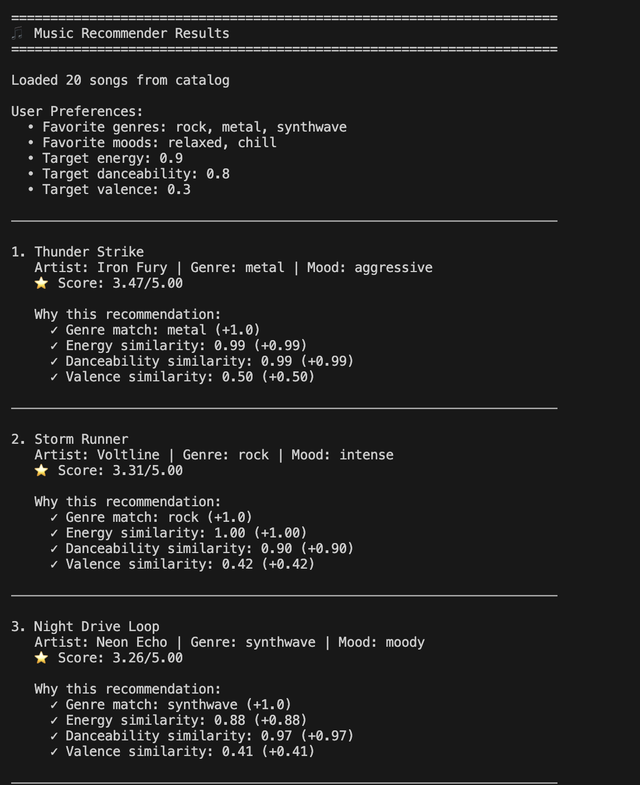
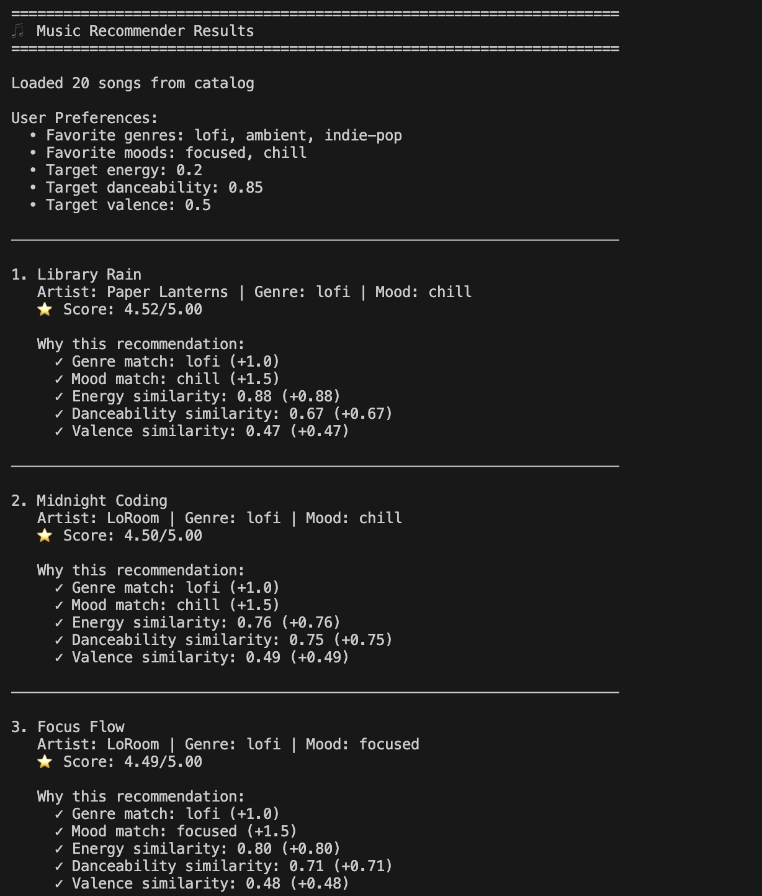
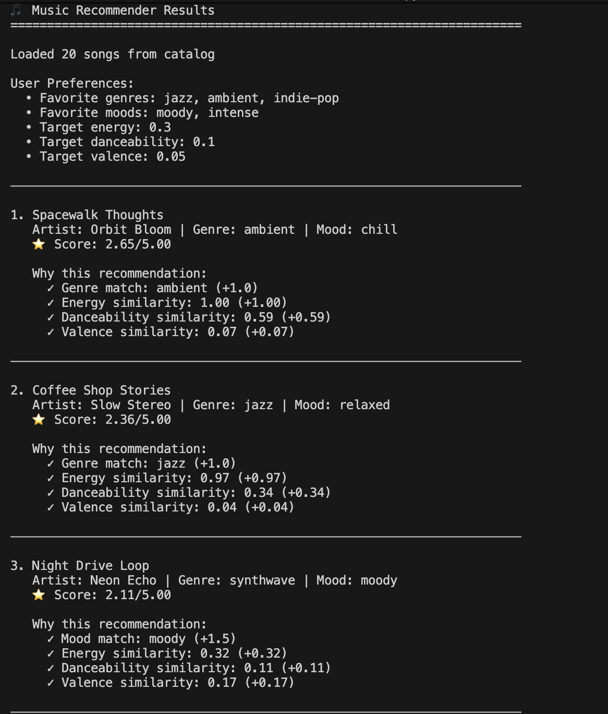

# 🎵 Music Recommender Simulation

## Project Summary

This is a content-based music recommender that suggests songs by matching song features (mood, genre, energy, danceability, valence) to user preferences. The system uses a Gaussian similarity scoring function with an energy-prioritized weighting strategy: we doubled the importance of energy matching (2.0 points) and halved genre importance (0.5 points) to test whether how a song *feels* matters more than its category label. Through testing, we discovered that this design creates strong "energy filter bubbles"—users who like calm music rarely get high-energy recommendations and vice versa—revealing how small weighting choices can profoundly shape what users experience, and why criticism of real-world recommenders like Spotify deserves empathy for the complexity involved.

---

## How The System Works

### Real-World Recommendation Principle

Real music recommenders work by matching songs to a user's taste profile using content-based filtering. They answer two key questions:
1. **Scoring Rule**: For each song, "How similar is this to what the user likes?"
2. **Ranking Rule**: For the full catalog, "In what order should we show these recommendations?"

Our simulation simplifies this to focus on understanding how these rules combine multiple features into meaningful suggestions.

### Our Design

**Song Features:**
- `genre` (categorical): pop, lofi, rock, ambient, jazz, synthwave, indie pop
- `mood` (categorical): happy, chill, intense, relaxed, focused, moody
- `energy` (numerical, 0–1): intensity and liveliness of the track
- `danceability` (numerical, 0–1): how well-suited the song is for dancing
- `valence` (numerical, 0–1): musical positivity and happiness
- `tempo_bpm` (numerical): beats per minute (60–152)

**UserProfile Stores:**
- Preferred `genre` and `mood` (what the user likes)
- Ideal `energy` level (user's preferred intensity)
- Ideal `danceability` level (activity context)
- Ideal `valence` (emotional tone preference)

**Scoring Logic:**
1. For categorical features (genre, mood): exact match = 1.0, no match = 0.0
2. For numerical features (energy, danceability, valence): use Gaussian similarity—songs close to the user's preference score higher than distant ones
3. Combine all feature scores using a weighted average (prioritizing mood and genre)

**Ranking Rule:**
- Sort all songs by combined score (highest first)
- Recommend the top-ranked songs that exceed a minimum score threshold

**What We Prioritize:**
- **Simplicity**: Few features, interpretable logic
- **Transparency**: Easy to explain why a song was recommended
- **User Context**: Features like energy and mood matter as much as genre

---

### Finalized Algorithm Recipe

**TOTAL SCORE = Categorical Score + Numerical Score**

#### Categorical Score (Exact Match)
- **Mood Match**: +1.5 points (perfect match = 1.5, no match = 0)
- **Genre Match**: +1.0 points (perfect match = 1.0, no match = 0)
- **Subtotal**: 0 to 2.5 points

#### Numerical Score (Gaussian Similarity)
- **Energy**: 0 to 1.0 points
  - How close song energy is to user's target energy
- **Danceability**: 0 to 1.0 points
  - How close song danceability is to user's target
- **Valence**: 0 to 0.5 points
  - How close song valence is to user's target (less weight)
- **Subtotal**: 0 to 2.5 points

#### Final Score
- **Total Range**: 0 to 5.0 points
- **Recommendation Threshold**: Songs with score ≥ 2.5 (roughly 50% threshold)

---

### Potential Biases

**Potential Dataset/Coverage Biases**
- **Genre Imbalance**: If your song catalog has 60% pop and 10% jazz songs, pop songs will dominate recommendations even if the user prefers jazz.
- **Mood Clustering**: If most "chill" songs are lofi, recommending chill moods = always lofi.
- **Artist Overrepresentation**: Nothing stops recommending 5 songs from the same artist.

**Potential Algorithm Design Biases**
- **"Average is Best"**: Gaussian similarity rewards songs close to user's target. Extreme songs always score lower, meaning that the algorithm misses users who actually want variety in energy, not just one level.
- **Mood Dominance**: Mood = +1.5 points, which is very achievable. Genre = +1.0 points. A song can hit 2.5 points just from matching mood and genre alone. This means categorical matches might overshadow numerical fit.
- **Valence Invisibility**: Valence = 0.5 weight (half of energy/danceability). Positive vs. negative songs barely matter. This system may miss emotional nuance.

---

## Example Outputs

Below are examples of the system in action across different user profiles. Each demonstrates how the recommender handles different preferences and edge cases.

### Profile 1: Smooth Jazz Listener (Baseline)

**User Profile:**
- **Preferred Genres**: Jazz, R&B, Hip-Hop, Reggae
- **Preferred Moods**: Relaxed, Chill, Laid-Back
- **Target Energy**: 0.4 | **Target Danceability**: 0.6 | **Target Valence**: 0.7


**What This Tests:**
This baseline profile shows the system working as expected. Songs like "Chit-Chat Lounge" (jazz, relaxed mood) and "Sweet Vibes" (reggae, laid-back mood) rank highly due to exact matches on both categorical preferences. The output demonstrates how the algorithm prioritizes mood and genre while using numerical features to fine-tune rankings.

---

### Profile 2: Party Paradox (Conflicting Preferences)

**User Profile:**
- **Preferred Genres**: Rock, Metal, Synthwave
- **Preferred Moods**: Relaxed, Chill
- **Target Energy**: 0.9 | **Target Danceability**: 0.8 | **Target Valence**: 0.3



**What This Tests:**
This edge case tests contradictory preferences—the user wants high-energy, danceable music but also wants it to feel relaxed and chill. This reveals whether the system can handle conflicting signals or if mood dominance (1.5 points) overpowers the high energy preference. You'll notice songs that match the genre and mood get high scores despite conflicting with the energy target.

---

### Profile 3: Lo-Fi Dancer (Paradoxical Numerical Preferences)

**User Profile:**
- **Preferred Genres**: Lofi, Ambient, Indie-Pop
- **Preferred Moods**: Focused, Chill
- **Target Energy**: 0.2 | **Target Danceability**: 0.85 | **Target Valence**: 0.5



**What This Tests:**
This profile tests contradictory numerical preferences—the user wants very low energy (0.2) but very high danceability (0.85). This is a real-world paradox (like lofi hip-hop: chill but rhythmic). The recommender must balance Gaussian similarity across conflicting numerical targets. This stress-tests whether the algorithm can recommend music that satisfies paradoxical preferences or if it compromises on both.

---

### Profile 4: Melancholy Minimalist (Valence Invisibility Test)

**User Profile:**
- **Preferred Genres**: Jazz, Ambient, Indie-Pop
- **Preferred Moods**: Moody, Intense
- **Target Energy**: 0.3 | **Target Danceability**: 0.1 | **Target Valence**: 0.05



**What This Tests:**
This extreme edge case tests whether very low valence (0.05—very sad, melancholic music) matters. Since valence only has 0.5 weight in the algorithm, this profile reveals if the system treats valence as nearly invisible. Songs that match mood and genre may score highly even if they don't match the extreme sadness preference, demonstrating the potential "Valence Invisibility" bias discussed in the algorithm section.

---

## Getting Started

### Setup

1. Create a virtual environment (optional but recommended):

   ```bash
   python -m venv .venv
   source .venv/bin/activate      # Mac or Linux
   .venv\Scripts\activate         # Windows

2. Install dependencies

```bash
pip install -r requirements.txt
```

3. Run the app:

```bash
python -m src.main
```

### Running Tests

Run the starter tests with:

```bash
pytest
```

You can add more tests in `tests/test_recommender.py`.

---

## Experiments You Tried

Use this section to document the experiments you ran. For example:

- What happened when you changed the weight on genre from 2.0 to 0.5
- What happened when you added tempo or valence to the score
- How did your system behave for different types of users

---

### Modified Algorithm Recipe (v2: Energy-Prioritized)

**Experimental change:** Double energy importance, halve genre importance to test whether prioritizing how a song *feels* produces better recommendations than matching exact categories.

**TOTAL SCORE = Categorical Score + Numerical Score**

#### Categorical Score (Exact Match)
- **Mood Match**: +1.5 points (unchanged)
- **Genre Match**: +0.5 points (halved from 1.0)
- **Subtotal**: 0 to 2.0 points

#### Numerical Score (Gaussian Similarity)
- **Energy**: 0 to 2.0 points (doubled from 1.0)
  - How close song energy is to user's target energy
- **Danceability**: 0 to 0.5 points (halved from 1.0 to balance)
  - How close song danceability is to user's target
- **Valence**: 0 to 0.5 points (unchanged)
  - How close song valence is to user's target (less weight)
- **Subtotal**: 0 to 3.0 points

#### Final Score
- **Total Range**: 0 to 5.0 points (maintained)
- **Recommendation Threshold**: Songs with score ≥ 2.5 (unchanged)

---

## Limitations and Risks

**Energy Filter Bubble**: The narrow Gaussian distribution (sigma=0.3) with a 2.0 weight on energy creates hard partitions between low-energy and high-energy music. Users who like calm music will almost never receive energetic songs, and vice versa, preventing serendipitous discovery.

**Missing Acousticness Feature**: The `likes_acoustic` user preference is defined in the UserProfile class but never used in scoring, so acoustic music lovers receive no personalized boost. Additionally, acoustic songs cluster in low-energy genres, making it impossible for users wanting both acoustic music and high energy to find matches.

**Tiny Catalog & Unrepresentative Dataset**: The system only evaluates 20 songs with limited genre and mood diversity. It doesn't reflect real-world music consumption where users stream millions of tracks from vastly more diverse styles and contexts.

**Binary Mood/Genre Matching**: Moods and genres use exact matching—"peaceful" and "relaxed" are treated as completely different, preventing fuzzy matching that mirrors how humans perceive musical similarity.

---

## Reflection

Read and complete `model_card.md`:

[**Model Card**](model_card.md)